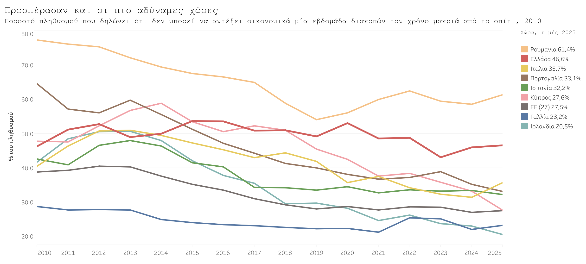
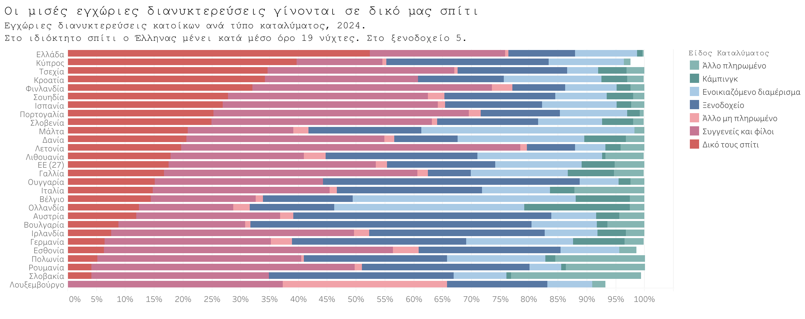
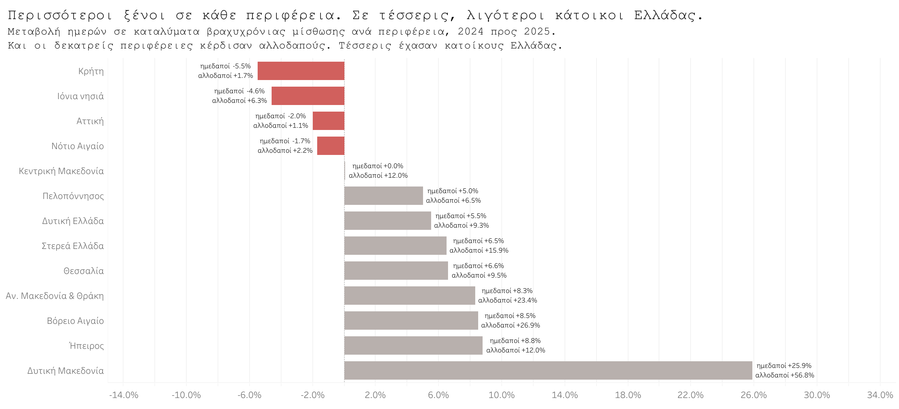

# Πόσο «τουριστική» είναι τελικά η Ελλάδα για τους ίδιους τους κατοίκους της;

*Το 46,6% των κατοίκων της χώρας δηλώνει ότι δεν αντέχει οικονομικά μία εβδομάδα διακοπών, έναντι 27,5% στην ΕΕ. Τα δεδομένα της Eurostat και της ΕΛΣΤΑΤ δείχνουν τι κάνει όποιος τελικά φεύγει.*

**Κωνσταντίνος Κολοβός**, Μαθηματικός (ΕΜΠ), MSc Business Analytics (ΟΠΑ)

*In English: [article-en.md](article-en.md)*

---

Το καλοκαίρι στην Ελλάδα σημαίνει γεμάτα πλοία, ουρές στα διόδια και ρεκόρ αφίξεων. Ο τουρισμός είναι η μία ιστορία που η χώρα λέει για τον εαυτό της με σιγουριά.

Την ίδια στιγμή, ένα στα δύο άτομα που ζει εδώ δηλώνει ότι δεν έχει την οικονομική δυνατότητα να λείψει μία εβδομάδα από το σπίτι του.

Το ποσοστό είναι 46,6% για το 2025, σύμφωνα με τη Eurostat. Ο μέσος όρος της Ευρωπαϊκής Ένωσης είναι 27,5%. Χειρότερα βρίσκεται μόνο η Ρουμανία.

*Η αδυναμία για μία εβδομάδα διακοπές, Ελλάδα και ΕΕ, 2010–2025. Πηγή: Eurostat, `ilc_mdes02`.*

Το 2010 η Ελλάδα ήταν στο 46,3% και η Ευρωπαϊκή Ένωση στο 38,8%. Δεκαπέντε χρόνια μετά, η Ένωση έχει κατέβει στο 27,5%.

Εμείς μείναμε εκεί που ήμασταν.

## Τι ακριβώς μετρά ο δείκτης

Η ερώτηση δεν είναι αν κάποιος πήγε διακοπές. Είναι αν **μπορεί** να πάει.

Και ο ορισμός είναι πιο αυστηρός απ' όσο δείχνει. Το εγχειρίδιο της Eurostat μετράει ως δυνατότητα και τη διαμονή σε δεύτερη κατοικία, και το σπίτι φίλων ή συγγενών, και το επιδοτούμενο ή δανεικό κατάλυμα. Ο χρόνος και η υγεία δεν πιάνονται ως λόγοι, εφόσον υπάρχουν τα χρήματα.

Όποιος απαντάει όχι, λέει επομένως δύο πράγματα ταυτόχρονα. Δεν διαθέτει ούτε λεφτά να πληρώσει, ούτε δωρεάν στέγη πουθενά.

Σε μια χώρα γεμάτη πατρικά και εξοχικά, αυτό αλλάζει τη σημασία του νούμερου. Το 46,6% δεν είναι υπερβολή. Είναι όσοι έμειναν χωρίς και τα δύο.

## Το εισόδημα εξηγεί το μεγαλύτερο μέρος

Το πραγματικό διάμεσο εισόδημα του τυπικού ελληνικού νοικοκυριού είναι **22,3% χαμηλότερο από το 2009**. Είναι η χειρότερη επίδοση στην Ευρωπαϊκή Ένωση. Μαζί με τη Γαλλία, η Ελλάδα είναι η μόνη χώρα που δεν έχει επιστρέψει στα προ κρίσης επίπεδα.

Οι έξι χώρες που πέρασαν κρίση χρέους ξεκίνησαν μαζί και κατέληξαν αλλού. Η Ιρλανδία βρίσκεται σήμερα 40,3% πάνω από το 2009, η Πορτογαλία 25,5%, η Κύπρος 8,0%. Η Ελλάδα 22,3% κάτω.

Το ΚΕΦΙΜ, με στοιχεία εθνικών λογαριασμών και εντελώς διαφορετική μέθοδο, καταλήγει στην ίδια κατάταξη.

Με άλλα λόγια, η φτώχεια είναι η κύρια εξήγηση και δεν χρειάζεται να την αναζητήσει κανείς αλλού. Το ενδιαφέρον αρχίζει από το επόμενο ερώτημα: **πώς κάνει διακοπές όποιος τελικά φεύγει.**

## Πού κοιμάται όποιος φεύγει

Το **52,4%** των διανυκτερεύσεων που κάνουν οι κάτοικοι της Ελλάδας μέσα στη χώρα γίνεται σε ιδιόκτητη κατοικία. Είναι το υψηλότερο ποσοστό στην Ευρωπαϊκή Ένωση, με μέσο όρο 17,5%.

Τα ευρωπαϊκά συγκριτικά στοιχεία που ακολουθούν αφορούν το 2024, το τελευταίο έτος που έχει δημοσιεύσει η Eurostat. Τα ελληνικά νούμερα του 2025 έρχονται από την ΕΛΣΤΑΤ.

*Εγχώριες διανυκτερεύσεις ανά τύπο καταλύματος, 2024. Πηγή: Eurostat, `tour_dem_tnac`.*

Αν προστεθούν και τα σπίτια φίλων και συγγενών, το μη πληρωμένο κατάλυμα φτάνει το **76,5%** των εγχώριων διανυκτερεύσεων. Στην ΕΕ το αντίστοιχο νούμερο είναι 55,3%.

Το ίδιο μοτίβο εμφανίζεται και στα ταξίδια στο εξωτερικό, όπου το δωρεάν κατάλυμα καλύπτει πάλι το 52% των νυχτών. Αλλάζει μόνο ποιανού είναι το σπίτι.

Η διαφορά φαίνεται και στη συχνότητα. Ο κάτοικος της Ελλάδας πραγματοποιεί μόλις **0,58** εγχώρια προσωπικά ταξίδια με τουλάχιστον μία διανυκτέρευση τον χρόνο, έναντι **1,69** για τον μέσο Ευρωπαίο. Στα ταξίδια δηλαδή βρισκόμαστε περίπου 66% κάτω. Στις διανυκτερεύσεις όμως, η απόσταση περιορίζεται σημαντικά: 5,8 έναντι 6,8 ανά κάτοικο, μόλις 15% λιγότερες.

Τα εγχώρια ταξίδια των κατοίκων της Ελλάδας είναι πολύ λιγότερα, αλλά κατά μέσο όρο πολύ μεγαλύτερα σε διάρκεια.

Και πολύ φθηνότερα. Ο ίδιος άνθρωπος ξοδεύει **42 ευρώ** τη νύχτα σε ταξίδι μέσα στη χώρα και **106** σε ταξίδι στο εξωτερικό, από την ίδια έρευνα της ΕΛΣΤΑΤ για το 2025. Όταν υπάρχει το σπίτι, οι διακοπές είναι μεγάλες και φθηνές. Όταν δεν υπάρχει, πληρώνει ευρωπαϊκές τιμές και μένει τις μισές μέρες.

## Δεκαπέντε τοις εκατό των ταξιδιών, οι μισές νύχτες

Τα ταξίδια δύο εβδομάδων και άνω είναι το **15,3%** των ταξιδιών των κατοίκων της Ελλάδας. Παράγουν όμως το **50,7%** των διανυκτερεύσεων και μόλις το **21,2%** της δαπάνης, σύμφωνα με την έρευνα διακοπών της ΕΛΣΤΑΤ για το 2025.

Η νύχτα σε αυτά τα ταξίδια κοστίζει **21 ευρώ**. Στα ταξίδια των τριών διανυκτερεύσεων κοστίζει **107**.

Τα 21 ευρώ τη νύχτα δεν πληρώνουν κατάλυμα σε καμία εμπορική μορφή. Και δεν είναι μόνο το κατάλυμα: το νούμερο περιλαμβάνει ολόκληρη τη δαπάνη του ταξιδιού, μεταφορά, φαγητό, τα πάντα.

Υπάρχει και δεύτερος τρόπος να δει κανείς το ίδιο πράγμα. Όχι κατά διάρκεια, αλλά κατά κατάλυμα.

Το **49,8%** των εγχώριων διανυκτερεύσεων γίνεται σε ιδιόκτητη εξοχική κατοικία, και η νύχτα εκεί κοστίζει **20 ευρώ**. Στο ξενοδοχείο κοστίζει **100**.

Δύο ανεξάρτητες τομές των ίδιων δεδομένων, και οι δύο δίνουν περίπου τις μισές διανυκτερεύσεις της χώρας, και οι δύο καταλήγουν γύρω στα είκοσι ευρώ.

## Τι άλλαξε το 2025

Στα φετινά στοιχεία εμφανίζεται μια μετατόπιση. Οι πληρωμένες διανυκτερεύσεις στα νησιά αυξήθηκαν **1,1%**, ενώ στην ηπειρωτική Ελλάδα **6,0%**.

*Μεταβολή ημερών σε καταλύματα βραχυχρόνιας μίσθωσης ανά περιφέρεια, 2024 προς 2025. Πηγή: ΕΛΣΤΑΤ, STO18.*

Και οι δεκατρείς περιφέρειες κέρδισαν αλλοδαπούς επισκέπτες. Τέσσερις έχασαν κατοίκους Ελλάδας: η Κρήτη, τα Ιόνια νησιά, η Αττική και το Νότιο Αιγαίο. Είναι οι τέσσερις με τη μεγαλύτερη ξένη ζήτηση.

Στον αντίποδα, η Ήπειρος κέρδισε 8,8% περισσότερους κατοίκους Ελλάδας, το Βόρειο Αιγαίο 8,5% και η Ανατολική Μακεδονία και Θράκη 8,3%.

Το ερώτημα αν οι τιμές λειτουργούν ως βασικό εμπόδιο **δεν μπορεί να απαντηθεί άμεσα** από τα διαθέσιμα επίσημα στοιχεία. Δεν δημοσιεύεται, σε επίπεδο ελληνικών περιφερειών, συστηματικός δείκτης του κόστους που αντιμετωπίζει ο κάτοικος Ελλάδας για ένα εγχώριο ταξίδι προς κάθε περιφέρεια. Το επιβεβαιώνει και το ΙΝΣΕΤΕ, το οποίο σημειώνει ότι «ελλείψει στοιχείων για την περιφερειακή κατανομή της συνολικής τουριστικής δαπάνης» εκτιμά την κατανομή προσεγγιστικά, με βάση τις εισπράξεις του εισερχόμενου τουρισμού.

Στην ίδια κατεύθυνση κινείται και η διάρκεια. Από το 2024 στο 2025 τα ταξίδια μιας έως τριών διανυκτερεύσεων μετακινήθηκαν από το 23,9% στο 26,7% του συνόλου, ενώ εκείνα των δεκαπέντε και άνω υποχώρησαν από 17,2% σε 15,3%. Παράλληλα, τα ταξίδια στο εξωτερικό μεγαλώνουν γρηγορότερα από τα εγχώρια κάθε χρονιά από το 2021.

Όλα αυτά αφορούν πληρωμένο κατάλυμα. Τα ιδιόκτητα εξοχικά και τα πατρικά, που είναι το μεγαλύτερο μέρος των ελληνικών διανυκτερεύσεων, δεν καταγράφονται ανά περιφέρεια πουθενά.

## Το ερώτημα που μένει

Μία χρονιά δεν είναι τάση. Τα στοιχεία του 2025 δείχνουν κατεύθυνση, όχι συμπέρασμα.

Υπάρχει όμως κάτι που τα δεδομένα λένε καθαρά. Ο δείκτης της Eurostat μετράει δυνατότητα, όχι συμπεριφορά, και πουθενά δεν δημοσιεύεται πόσοι κάτοικοι της Ελλάδας έφυγαν τελικά για μία εβδομάδα. Δεν ξέρουμε πόσοι είναι, και δεν το μετράει κανείς.

Ξέρουμε όμως ότι όσοι φεύγουν για πολύ, φεύγουν φθηνά. Και ότι το φθηνά προϋποθέτει ένα σπίτι που κάποιος στην οικογένεια αγόρασε ή έχτισε πριν από χρόνια.

**Οι ελληνικές διακοπές, σε μεγάλο βαθμό, δεν αγοράζονται. Κληρονομούνται.**

Πίσω από τη συζήτηση για αφίξεις, έσοδα και νέα ρεκόρ, προκύπτει επομένως ένα διαφορετικό ερώτημα. Τι θα κάνει η γενιά που δεν έχει τίποτα να κληρονομήσει;

---

Ο κώδικας, τα δεδομένα και η πλήρης μεθοδολογία, μαζί με όσα δεν αποδεικνύονται: [github.com/k-kolovos/greek-holidays-income](https://github.com/k-kolovos/greek-holidays-income)

**Πηγές:** Eurostat (EU-SILC, στατιστικές τουρισμού, ΕνΔΤΚ), ΕΛΣΤΑΤ (έρευνα διακοπών 2025, κίνηση καταλυμάτων 2025, βραχυχρόνιες μισθώσεις 2025).

Η σύγκριση με τους εθνικούς λογαριασμούς βασίζεται στο policy report του ΚΕΦΙΜ «Πού βρίσκεται το εισόδημα του ελληνικού νοικοκυριού σήμερα σε σχέση με την αρχή της κρίσης το 2009», Ν. Ρώμπαπας και Κ. Σαραβάκος, Δεκέμβριος 2025.

Η παραδοχή για την περιφερειακή κατανομή της τουριστικής δαπάνης προέρχεται από τη μελέτη του ΙΝΣΕΤΕ «Η συμβολή του τουρισμού στην ελληνική οικονομία το 2025», σημείωση Πίνακα 12.
